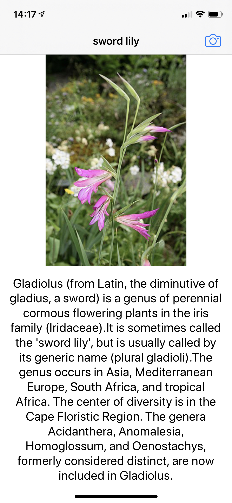

# WhatFlower

## Intro
With WhatFlower you can take a picture of a plant and see the name, a picture and a description of the plant. The app is powered by Wikipedias API and the Oxford-102 plant classification Keras model.

## How to use it
To start the app clone the project with XCode and open the .xcodeworkspace file.
Not the .xcodeproject file, this will only cause you errors with the installed pods.
Next, change the bundle identifier to your standard identifier or something random.

Then, just run the app on a physical iOS device.

## Screenshots of the app
This is an example screen of what you can see after taking a picture of a plant.

Login screen of the app.

## Used 3rd party libraries
Special thanks to the creators of these libraries:
+ [SwiftyJSON](https://cocoapods.org/pods/swiftyjson)
+ [Alamofire](https://cocoapods.org/pods/Alamofire)
+ [SDWebImage](https://cocoapods.org/pods/SDWebImage)

## Errors
If an error occurs while using the app, please feel free to open an issue or create a pull request.
Thanks :)

Liam
